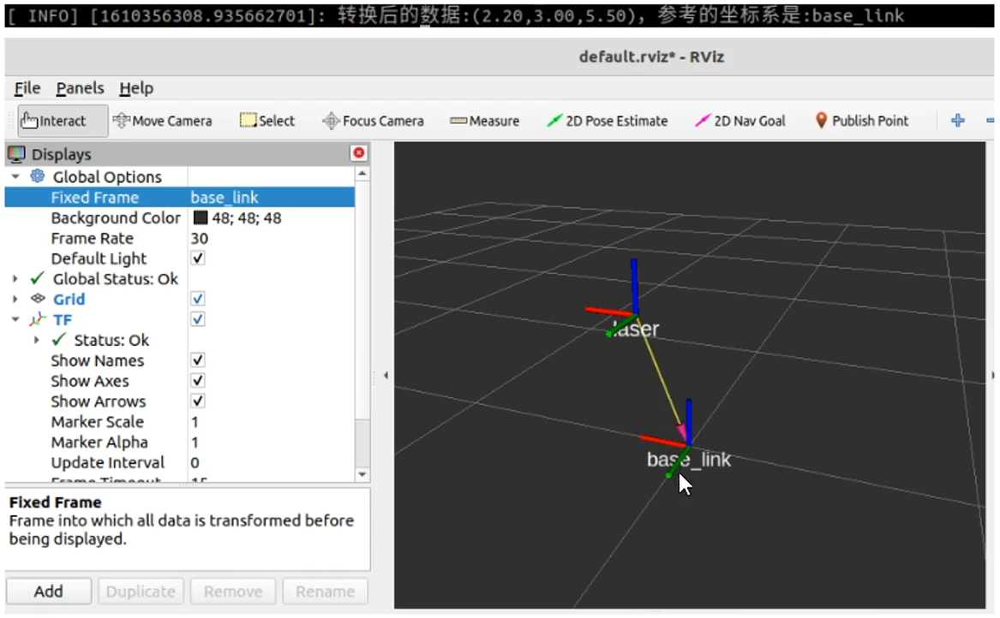

## 参考资料

教程链接:[【奥特学园】ROS机器人入门课程《ROS理论与实践》零基础教程](https://www.bilibili.com/video/BV1Ci4y1L7ZZ?p=182)

配套文档链接：[奥特学园ROS配套文档](http://www.autolabor.com.cn/book/ROSTutorials/)

## TF坐标转换

### 5.1.1 坐标msg消息

订阅发布模型中数据载体msg是一个重要实现，首先需要了解一下，在坐标转换实现中常用的<code>geometry_msgs/TransformStamped</code> 和<code>geometry_msgs/PointStamped</code>  

前者用于传输坐标系相关位置信息，后者用于传输某个坐标系内坐标点的信息。在坐标变换中，频繁的需要使用到坐标系的相对关系以及坐标点信息。    

#### 1.geometry_msgs/TransformStamped

命令行键入：<code>rosmsg info geometry_msgs/TransformStamped</code>  

> rosmsg命令可以显示msg格式

```javascript
std_msgs/Header header      #头信息
  uint32 seq                                       #|--序列号
  time stamp                                     #|--时间戳
  string frame_id                             #|--坐标ID
string child_frame_id           #子坐标系的id
geometry_msgs/Transform transform        #坐标信息
  geometry_msgs/Vector3 translation       #偏移量
    float64 x                                                                     #|-- x方向的偏移量
    float64 y                                                                     #|-- y方向的偏移量
    float64 z                                                                     #|-- z方向的偏移量
  geometry_msgs/Quaternion rotation     #四元数
    float64 x
    float64 y
    float64 z
    float64 w
```

### 5.1.2 静态坐标变换

所谓静态坐标变换，是指两个坐标系之间的相对位置是固定的。  

**需求描述**  

现在一机器人模型，核心构成包含主体与雷达，各对应一坐标系，坐标系的原点分别位于主体与雷达的物理中心，已知雷达原点相对于主体原点位移关系如下：x 0.2 ,y 0.1, z 0.5.当前雷达检测到一障碍物，在雷达坐标系中障碍物的坐标为(2.0, 3.0, 5.0),请问，该障碍物相对于主体的坐标是多少？  



**实现分析**

1.坐标系相对关系，可以通过发布方发布  

2.订阅方，订阅到发布的坐标系相对关系，再传入坐标点信息（可以写死），然后借助于tf实现坐标变换，并将结果输出。

**实现流程**：C++与Python实现流程一致  

1.新建功能包，添加依赖  

2.编写发布方实现  

3.编写订阅方实现  

4.执行并查看结果  

**方案A：C++实现**  

**1.创建功能包**  

创建项目功能包依赖于tf2、tf2_ros、tf2_geometry__msgs、roscpp、rospy、std_msgs、geometry_msgs  

**2.发布方**  

下面程序设置的是child相对于base的平移和旋转关系。  

```c++
#include <ros/ros.h>
#include <tf2_ros/static_transform_broadcaster.h>
#include <geometry_msgs/TransformStamped.h>
#include <tf2/LinearMath/Quaternion.h>
/*
    需求：发布两个坐标系的相对关系

    流程：
        1.包含头文件；
        2.设置编码 节点初始化 NodeHandle;
        3.创建发布对象；
        4.组织被发布的消息；
        5.发布数据；
        6.spin();
*/
int main(int argc, char **argv)
{
    //     2.设置编码 节点初始化 NodeHandle;
    setlocale(LC_ALL,"");
    ros::init(argc,argv,"static_pub");
    ros::NodeHandle nh;
    /*setlocale(LC_ALL,"");       ：   C++中的locale设置：
    C/C++程序中，locale（即系统区域设置，即国家或地区设置）将决定程序所使用的当前语言编码、日期格式、数字格式及其它与区域有关的设置，
    locale设置的正确与否将影响到程序中字符串处理（wchar_t如何输出、strftime()的格式等）。
    因此，对于每一个程序，都应该慎重处理locale设置。
    参考链接1：https://blog.csdn.net/haiross/article/details/45074355
    参考链接2：https://blog.csdn.net/sxhlovehmm/article/details/40919429
    */
    //     3.创建发布对象；
    tf2_ros::StaticTransformBroadcaster pub;
    //     4.组织被发布的消息；
    geometry_msgs::TransformStamped tfs;
    tfs.header.stamp = ros::Time::now();
    tfs.header.frame_id = "base_link";
    tfs.child_frame_id="laser";
    tfs.transform.translation.x=0.2;
    tfs.transform.translation.y=0.0;
    tfs.transform.translation.z=0.5;

    // 需要根据欧拉角转换
    tf2::Quaternion qtn;  //创建四元数对象
    //向该对象设置欧拉角，这个对象可以将欧拉角转换成四元数
    qtn.setRPY(0,0,0);   //由于小车中的雷达和本次没有角度偏差，只有位移偏差，所以将欧拉角都设置为0，单位：rad
    tfs.transform.rotation.x = qtn.getX();
    tfs.transform.rotation.y = qtn.getY();
    tfs.transform.rotation.z = qtn.getZ();
    tfs.transform.rotation.w = qtn.getW();

    //     5.发布数据；
    pub.sendTransform(tfs);
    //     6.spin();
    ros::spin();  //ROS的回旋函数，会进入循环
    return 0;
}
```


**3.订阅方** 

```c++
#include <ros/ros.h>
#include <tf2_ros/transform_listener.h>
#include "tf2_ros/buffer.h"
#include <geometry_msgs/PointStamped.h>
#include <tf2_geometry_msgs/tf2_geometry_msgs.h>
/*
    订阅方：订阅发布的坐标系相对关系，传入一个坐标点，调用tf实现转化

    流程：
        1.包含头文件
        2.编码、初始化、NodeHandle（必须的）
        3.创建订阅对象；  ---->  订阅坐标系相对关系
        4.组织一个坐标点数据；
        5.转换算法，需要调用TF内置实现；
        6.最后输出
*/
int main(int argc, char **argv)
{
    // 2.编码、初始化、NodeHandle（必须的）
    setlocale(LC_ALL, "");
    ros::init(argc, argv, "static_sub");
    ros::NodeHandle nh;
    // 3.创建订阅对象；  ---->  订阅坐标系相对关系
    //3-1.创建一个buffer缓存
    tf2_ros::Buffer buffer;
    //3-2.再创建监听对象（监听对象可以将订阅的数据存入buffer）
    tf2_ros::TransformListener listener(buffer);   //订阅者订阅到消息的时候，会把消息放到buffer里。结合使用
    // 4.组织一个坐标点数据；
    geometry_msgs::PointStamped ps;
    ps.header.frame_id = "laser";
    ps.header.stamp = ros::Time::now();
    ps.point.x = 2.0;
    ps.point.y = 3.0;
    ps.point.z = 5.0;
    //添加休眠,要不然可能还没有收到buffer，就运行到ps_out = buffer.transform(ps,"base_link");，会导致运行时报错
    // ros::Duration(2).sleep();
    // 5.转换算法，需要调用TF内置实现；
    ros::Rate rate(10);
    while(ros::ok())
    {
        //核心代码  --- 将ps转换成相对于base_link的坐标点
        geometry_msgs::PointStamped ps_out;
        /*
        调用了buffer的转换函数transform
        参数1：被转换的坐标点（包含了原坐标系的信息）
        参数2：目标坐标系
        返回值：输出的目标坐标系下的坐标点

        ps1：调用时必须包含头文件 tf2_geometry_msgs/tf2_geometry_msgs.h，否则编译器报错
        ps2：运行时存在的问题：抛出一个异常base_link不存在
                        原因：订阅数据是一个耗时操作，可能在调用transform转换函数时，坐标系的相对关系还没有订阅到，因此出现异常
                        解决：
                            方案1：在调用转换函数前，执行休眠ros::Duration(2).sleep();
                            方案2：进行异常处理(建议)
        */
       try
       {
           ps_out = buffer.transform(ps,"base_link");    
            // 6.最后输出
            ROS_INFO("转换后的坐标值：（%.2f,%.2f,%.2f）,参考的坐标系：%s",
            ps_out.point.x,
            ps_out.point.y,
            ps_out.point.z,
            ps_out.header.frame_id.c_str());
       }
       catch(const std::exception& e)
       {
            //    std::cerr << e.what() << '\n';
            ROS_INFO("异常消息：%s",e.what());
       }
       
        
        rate.sleep();
        ros::spinOnce();
    }
    return 0;
}
```

**补充1：**  

当坐标系之间的相对位置固定时，那么所需参数也是固定的：父系坐标名称、子级坐标系名称、x偏移量、y偏移量、z偏移量、x翻滚角度、y俯仰角度、z偏航角度，实现逻辑相同，参数不同，那么ROS系统就已经封装好了专门的节点，使用方式如下：  

`rosrun tf2_ros static_transform_publisher x偏移量 y偏移量 z偏移量 z偏航角度 y偏航角度 x翻转角度 父级坐标系 子级坐标系`  

示例：`rosrun tf2_ros static_transform_publisher 0.2 0 0.5 0 0 0 /baselink /laser`  

也建议使用该中方式直接实现静态坐标系相对信息发布。  

**补充2：**  

可以借助于rviz显示坐标系关系，具体操作：  

- 新建窗口输入命令：`rviz`  

- 在启动的rviz中设置Fixed Frame为`base_link`;  
- 点击左下的add按钮，在弹出的窗口中选择TF组件，即可显示坐标关系。  

### 5.1.3 动态坐标变换

所谓动态坐标变换，，是指两个坐标系之间的相对位置是变化的。

**需求描述：**

启动turtlesim_node，该节点中窗体有一个世界坐标系（左下角为坐标系原点），乌龟是另一个坐标系，键盘控制乌龟运动，将两个坐标系的相对位置动态发布。


**实现分析：**

1. 乌龟本身不但可以看作坐标系，也是世界坐标系中的一个坐标点

2. 订阅turtle1/pose，可以获取乌龟在世界坐标系的x坐标、y坐标、偏移量以及线速度和角速度

3. 将pose信息转换成坐标系相对信息并发布

**实现流程：**C++与Python实现流程一致

1. 新建功能包，添加依赖
2. 创建坐标相对关系发布方（同时需要订阅乌龟位姿信息）
3. 创建坐标相对关系订阅方
4. 执行  

**方案A:C++实现**

**1.创建功能包**  

创建项目功能包依赖于tf2、tf2_ros、tf2_geometry__msgs、roscpp、rospy、std_msgs、geometry_msgs、turtlesim

**2.发布方**  

```c++
#include <ros/ros.h>
#include <turtlesim/Pose.h>
#include <tf2_ros/transform_broadcaster.h>
#include <geometry_msgs/TransformStamped.h>
#include <tf2/LinearMath/Quaternion.h>
/*
    发布方：需要订阅乌龟的位姿信息，转换成相对于窗体（世界坐标系）的坐标关系，并发布
    准备：
            话题： /turtle1/pose
            消息：/turtlesim/pose
    
    流程：
            1.包含头文件；
            2.设置编码、初始化、NodeHandle;
            3.创建订阅对象，订阅 /turtle1/pose;
            4.回调函数处理订阅的消息：将位姿信息转换成坐标相对关系并发布（关注）
*/
void doPose(const turtlesim::Pose::ConstPtr& pose)
{
    //获取位姿信息，转换为坐标系相对关系（核心），并发布
    //a.创建发布对象
    static tf2_ros::TransformBroadcaster pub;    //使用静态的，就不会重复声明了
    //b.组织被发布的数据
    geometry_msgs::TransformStamped ts;
    ts.header.frame_id="world";
    ts.header.stamp=ros::Time::now();
    ts.child_frame_id="turtle1";
    //坐标系偏移量设置
    ts.transform.translation.x=pose->x;
    ts.transform.translation.y=pose->y;
    ts.transform.translation.z=0;
    //坐标系四元数
    /*
        位姿信息中没有四元数，但是有个偏航角度，又已知乌龟是2D的，没有翻滚与俯仰角度，
        所以可以得出乌龟的欧拉角：0 0 theta
    */
   tf2::Quaternion qtn;
   qtn.setRPY(0,0,pose->theta);
   ts.transform.rotation.x=qtn.getX();
   ts.transform.rotation.y=qtn.getY();
   ts.transform.rotation.y=qtn.getZ();
   ts.transform.rotation.w=qtn.getW();
    // c.发布
    pub.sendTransform(ts);
}
int main(int argc, char **agrv)
{
    // 2.设置编码、初始化、NodeHandle;
    setlocale(LC_ALL, "");
    ros::init(argc, agrv, "dynamic_pub");
    ros::NodeHandle nh;
    // 3.创建订阅对象，订阅 /turtle1/pose;
    ros::Subscriber sub = nh.subscribe("/turtle1/pose", 100, doPose);
    // 4.回调函数处理订阅的消息：将位姿信息转换成坐标相对关系并发布（关注）
    ros::spin();
    return 0;
}
```

**3.订阅方**  

   

```c++
#include <ros/ros.h>
#include <tf2_ros/transform_listener.h>
#include "tf2_ros/buffer.h"
#include <geometry_msgs/PointStamped.h>
#include <tf2_geometry_msgs/tf2_geometry_msgs.h>
/*
    订阅方：订阅发布的坐标系相对关系，传入一个坐标点，调用tf实现转化

    流程：
        1.包含头文件
        2.编码、初始化、NodeHandle（必须的）
        3.创建订阅对象；  ---->  订阅坐标系相对关系
        4.组织一个坐标点数据；
        5.转换算法，需要调用TF内置实现；
        6.最后输出
*/
int main(int argc, char **argv)
{
    // 2.编码、初始化、NodeHandle（必须的）
    setlocale(LC_ALL, "");
    ros::init(argc, argv, "static_sub");
    ros::NodeHandle nh;
    // 3.创建订阅对象；  ---->  订阅坐标系相对关系
    //3-1.创建一个buffer缓存
    tf2_ros::Buffer buffer;
    //3-2.再创建监听对象（监听对象可以将订阅的数据存入buffer）
    tf2_ros::TransformListener listener(buffer);   //订阅者订阅到消息的时候，会把消息放到buffer里。结合使用
    // 4.组织一个坐标点数据；
    //参考的坐标系
    geometry_msgs::PointStamped ps;
    ps.header.frame_id = "turtle1";
    //时间戳
    //ps.header.stamp = ros::Time(0.0);   //设置0.0相当于告诉坐标转换不要管我的时间戳了
    // ps.header.stamp = ros::Time::now();  
    //但是按照up说的会拿点的时间戳和坐标变换的时间戳进行比对是否比较相近，不相近就会抛出异常，
    //但是按理按理来说也10hz的时间戳也没差多少啊，那怎么样才正确呢？还有啥用呢
    ps.point.x = 2.0;
    ps.point.y = 3.0;
    ps.point.z = 5.0;
    //添加休眠,要不然可能还没有收到buffer，就运行到ps_out = buffer.transform(ps,"base_link");，会导致运行时报错
    // ros::Duration(2).sleep();
    // 5.转换算法，需要调用TF内置实现；
    ros::Rate rate(10);
    while(ros::ok())
    {
        //核心代码  --- 将ps转换成相对于base_link的坐标点
        geometry_msgs::PointStamped ps_out;
        /*
        调用了buffer的转换函数transform
        参数1：被转换的坐标点（包含了原坐标系的信息）
        参数2：目标坐标系
        返回值：输出的目标坐标系下的坐标点

        ps1：调用时必须包含头文件 tf2_geometry_msgs/tf2_geometry_msgs.h，否则编译器报错
        ps2：运行时存在的问题：抛出一个异常base_link不存在
                        原因：订阅数据是一个耗时操作，可能在调用transform转换函数时，坐标系的相对关系还没有订阅到，因此出现异常
                        解决：
                            方案1：在调用转换函数前，执行休眠ros::Duration(2).sleep();
                            方案2：进行异常处理(建议)
        */
       try
       {
           ps_out = buffer.transform(ps,"world");    
            // 6.最后输出
            ROS_INFO("转换后的坐标值：（%.2f,%.2f,%.2f）,参考的坐标系：%s",
            ps_out.point.x,
            ps_out.point.y,
            ps_out.point.z,
            ps_out.header.frame_id.c_str());
       }
       catch(const std::exception& e)
       {
            //    std::cerr << e.what() << '\n';
            ROS_INFO("异常消息：%s",e.what());
       }
       
        
        rate.sleep();
        ros::spinOnce();
    }
    return 0;
}
```

###    5.1.4 多坐标转换

需求描述：  

现有坐标系统，父级坐标系统world下有两子级系统son1,son2,son1相对与world，以及son2相对于world的关系是已知的，求son1原点在son2中的坐标，又已知在son1中一点的坐标，要求求出该点在son2中的坐标  

**实现分析：**

1. 首先，需要发布son1相对于world，以及son2相对于world的坐标消息  
2. 然后，需要订阅坐标发布消息，并取出订阅的消息，借助于tf2实现son1和son2的转换  
3. 最后，还要实现坐标点的转换  

**实现流程:**C++与Python实现流程一致

1. 新建功能包，添加依赖
2. 创建坐标相对关系发布方（需要发布两个坐标相对关系）
3. 创建坐标相对关系订阅方
4. 执行

**方案A：C++实现**

**1.创建功能包**  

创建项目功能包依赖于tf2、tf2_ros、tf2_geometry__msgs、roscpp、rospy、std_msgs、geometry_msgs、turtlesim

**2.发布方**  

```xml
<launch>

​    <node pkg="tf2_ros" type="static_transform_publisher" name="son1" args="5 0 0 0 0 0 /world /son1" output="screen" />

​    <node pkg="tf2_ros" type="static_transform_publisher" name="son2" args="3 0 0 0 0 0 /world /son2" output="screen" />

</launch>


```

**3.订阅方**

```c++
#include "ros/ros.h"
#include <tf2_ros/transform_listener.h>
#include <tf2_ros/buffer.h>
#include <geometry_msgs/PointStamped.h>
#include <tf2_geometry_msgs/tf2_geometry_msgs.h>
#include <geometry_msgs/TransformStamped.h>

/*
    订阅方实现：
            1.计算son1与son2的相对关系  
            2.计算son1中某个坐标点在son2中的坐标值

    流程：
            1.包含头文件;
            2.编码、初始化、NodeHandle;
            3.创建订阅对象；
            4.编写解析逻辑；
            5.spinOnce();
*/

int main(int argc, char **argv)
{
    // 2.编码、初始化、NodeHandle;
    setlocale(LC_ALL, "");
    ros::init(argc, argv, "tfs_sub");
    ros::NodeHandle nh;
    // 3.创建订阅对象；
    tf2_ros::Buffer buffer;
    tf2_ros::TransformListener sub(buffer);
    // 4.编写解析逻辑；
    // 创建坐标点
    geometry_msgs::PointStamped psAtSon1;
    psAtSon1.header.stamp = ros::Time::now();
    psAtSon1.header.frame_id = "son1";
    psAtSon1.point.x = 1.0;
    psAtSon1.point.y = 2.0;
    psAtSon1.point.z = 3.0;

    ros::Rate rate(10);
    while (ros::ok())
    {
        //核心
        try
        {
            //1.计算son1与son2的相对关系
            /*
                A相对于B的坐标系

                参数1：目标坐标系   B
                参数2：源坐标系        A
                参数3：ros::TIme(0)  取间隔最短的两个坐标关系帧计算相对关系
                返回值：geometry_msgs::TransformStamped 源相对于目标坐标系的相对关系
            */
            geometry_msgs::TransformStamped son1ToSon2 = buffer.lookupTransform("son2", "son1", ros::Time(0));   //lookupTransform("父级", "子级", ros::Time(0))
            //ros::Time(0)的意思是查找son2和son1之间最近的坐标系消息之间的坐标关系
            ROS_INFO("son1 相对于 son2 的信息：父级：%s, 子级：%s 偏移量(%.2f, %.2f, %.2f)",
                     son1ToSon2.header.frame_id.c_str(),  //son2
                     son1ToSon2.child_frame_id.c_str(),   //son1
                     son1ToSon2.transform.translation.x,
                     son1ToSon2.transform.translation.y,
                     son1ToSon2.transform.translation.z);
            //2.计算son1中某个坐标点在son2中的坐标值
            geometry_msgs::PointStamped psAtSon2 = buffer.transform(psAtSon1, "son2");
            ROS_INFO("坐标点在son2中的值(%.2f, %.2f, %.2f)",
                     psAtSon2.point.x,
                     psAtSon2.point.y,
                     psAtSon2.point.z);
        }
        catch (const std::exception &e)
        {
            // std::cerr << e.what() << '\n';
            ROS_INFO("错误提示：%s", e.what());
        }
        // 5.spinOnce();
        ros::spinOnce();
        rate.sleep();
    }
}
```

### 5.1.5 坐标系关系查看

在机器人系统中，涉及的坐标系有多个，为了方便查看，ros提供了专门的工具，可以用于生成显示坐标系关系的pdf文件，该文件包含树形结构的坐标系图谱。

**6.1准备**

首先调用`rospack find tf2_tools`查看是否包含该功能包，如果没有，请使用如下命令安装：

`sudo apt install ros-melodic-tf2-tools`

### 5.1.6 TF坐标变换实操

需求描述：  

程序启动之初：产生两只乌龟，中间的乌龟（A）和左下乌龟（B），B会自动运行至A的位置，并且键盘控制时，只是控制A的运动，但是B可以跟随A运行  

**结果演示：**  


**实现分析：**

乌龟跟随实现的核心，是乌龟A和B都要发布相对世界坐标系的坐标信息，然后，订阅到该信息需要转换获取A相对于B坐标系的信息，最后，再生成速度信息，并控制B运动。  

1. 启动乌龟显示节点
2. 在乌龟显示窗体中生成一只新的乌龟（需要使用服务）
3. 编写两只乌龟发布坐标信息的节点
4. 编写订阅节点订阅坐标信息并生成新的相对关系生成速度信息

实现流程：C++与Python实现流程一致   

1. 新建功能包，添加依赖
2. 编写服务客户端，用于生成一只新的乌龟
3. 编写发布方，发布两只乌龟的坐标信息
4. 编写订阅方，订阅两只乌龟信息，生成速度信息并发布
5. 运行

**准备工作：**

1.了解如何创建第二只乌龟，且不受键盘控制

创建第二只乌龟需要使用rosservice，话题使用的是spawn

```
rosservice call /spawn "x: 1.0
y: 1.0
theta: 1.0
name: 'turtle_flow'" 
name: "turtle_flow"
```

键盘是无法控制第二只乌龟运动的，因为使用的话题:/第二只乌龟名称/cmd_vel,对应的要控制乌龟运动必须发布对应的话题消息

2.了解如何获取两只乌龟的坐标

是通过话题 /乌龟名称/pose来获取的

```
x: 1.0 //x坐标
y: 1.0 //y坐标
theta: -1.21437060833 //角度
linear_velocity: 0.0 //线速度
angular_velocity: 1.0 //角速度
```

**方案A:C++实现**

**1.创建功能包**

创建项目功能包依赖于 tf2、tf2_ros、tf2_geometry_msgs、roscpp rospy std_msgs geometry_msgs、turtlesim

 **2.服务客户端(生成乌龟)**

```cpp
/* 
    创建第二只小乌龟
 */
#include "ros/ros.h"
#include "turtlesim/Spawn.h"

int main(int argc, char *argv[])
{

    setlocale(LC_ALL,"");

    //执行初始化
    ros::init(argc,argv,"create_turtle");
    //创建节点
    ros::NodeHandle nh;
    //创建服务客户端
    ros::ServiceClient client = nh.serviceClient<turtlesim::Spawn>("/spawn");

    ros::service::waitForService("/spawn");
    turtlesim::Spawn spawn;
    spawn.request.name = "turtle2";
    spawn.request.x = 1.0;
    spawn.request.y = 2.0;
    spawn.request.theta = 3.12415926;
    bool flag = client.call(spawn);
    if (flag)
    {
        ROS_INFO("乌龟%s创建成功!",spawn.response.name.c_str());
    }
    else
    {
        ROS_INFO("乌龟2创建失败!");
    }

    ros::spin();

    return 0;
}
```

**3.发布方（发布两只乌龟的坐标信息）**

可以订阅乌龟的位姿信息，然后再转换成坐标信息，两只乌龟的实现逻辑相同，只是订阅的话题名称，生成的坐标信息等稍有差异，可以将差异部分通过参数传入：

- 该节点需要启动两次
- 每次启动时都需要传入乌龟节点名称（第一次是turtle1第二次是turtle2）

```cpp
/*  
    该文件实现:需要订阅 turtle1 和 turtle2 的 pose，然后广播相对 world 的坐标系信息

    注意: 订阅的两只 turtle,除了命名空间(turtle1 和 turtle2)不同外,
          其他的话题名称和实现逻辑都是一样的，
          所以我们可以将所需的命名空间通过 args 动态传入

    实现流程:
        1.包含头文件
        2.初始化 ros 节点
        3.解析传入的命名空间
        4.创建 ros 句柄
        5.创建订阅对象
        6.回调函数处理订阅的 pose 信息
            6-1.创建 TF 广播器
            6-2.将 pose 信息转换成 TransFormStamped
            6-3.发布
        7.spin

*/
//1.包含头文件
#include "ros/ros.h"
#include "turtlesim/Pose.h"
#include "tf2_ros/transform_broadcaster.h"
#include "tf2/LinearMath/Quaternion.h"
#include "geometry_msgs/TransformStamped.h"
//保存乌龟名称
std::string turtle_name;


void doPose(const turtlesim::Pose::ConstPtr& pose){
    //  6-1.创建 TF 广播器 ---------------------------------------- 注意 static
    static tf2_ros::TransformBroadcaster broadcaster;
    //  6-2.将 pose 信息转换成 TransFormStamped
    geometry_msgs::TransformStamped tfs;
    tfs.header.frame_id = "world";
    tfs.header.stamp = ros::Time::now();
    tfs.child_frame_id = turtle_name;
    tfs.transform.translation.x = pose->x;
    tfs.transform.translation.y = pose->y;
    tfs.transform.translation.z = 0.0;
    tf2::Quaternion qtn;
    qtn.setRPY(0,0,pose->theta);
    tfs.transform.rotation.x = qtn.getX();
    tfs.transform.rotation.y = qtn.getY();
    tfs.transform.rotation.z = qtn.getZ();
    tfs.transform.rotation.w = qtn.getW();
    //  6-3.发布
    broadcaster.sendTransform(tfs);

} 

int main(int argc, char *argv[])
{
    setlocale(LC_ALL,"");
    // 2.初始化 ros 节点
    ros::init(argc,argv,"pub_tf");
    // 3.解析传入的命名空间
    if (argc != 2)
    {
        ROS_ERROR("请传入正确的参数");
    } else {
        turtle_name = argv[1];
        ROS_INFO("乌龟 %s 坐标发送启动",turtle_name.c_str());
    }

    // 4.创建 ros 句柄
    ros::NodeHandle nh;
    // 5.创建订阅对象
    ros::Subscriber sub = nh.subscribe<turtlesim::Pose>(turtle_name + "/pose",1000,doPose);
    //     6.回调函数处理订阅的 pose 信息
    //         6-1.创建 TF 广播器
    //         6-2.将 pose 信息转换成 TransFormStamped
    //         6-3.发布
    // 7.spin
    ros::spin();
    return 0;
}
```

**4.订阅方（解析坐标信息并生成速度信息）**

```cpp
#include "ros/ros.h"
#include <tf2_ros/transform_listener.h>
#include <tf2_ros/buffer.h>
#include <geometry_msgs/PointStamped.h>
#include <tf2_geometry_msgs/tf2_geometry_msgs.h>
#include <geometry_msgs/TransformStamped.h>
#include <geometry_msgs/Twist.h>

/*
    需求1：换算出turtle1相对于turtle2的关系
    需求2：计算角速度和线速度并发布
*/

int main(int argc, char **argv)
{
    // 2.编码、初始化、NodeHandle;
    setlocale(LC_ALL, "");
    ros::init(argc, argv, "tfs_sub");
    ros::NodeHandle nh;
    // 3.创建订阅对象；
    tf2_ros::Buffer buffer;
    tf2_ros::TransformListener sub(buffer);
    // A.创建发布对象
    ros::Publisher pub = nh.advertise<geometry_msgs::Twist>("/turtle2/cmd_vel", 100);
    // 4.编写解析逻辑；

    ros::Rate rate(10);
    while (ros::ok())
    {
        //核心
        try
        {
            //1.计算son1与son2的相对关系
            /*
                A相对于B的坐标系

                参数1：目标坐标系   B
                参数2：源坐标系        A
                参数3：ros::TIme(0)  取间隔最短的两个坐标关系帧计算相对关系
                返回值：geometry_msgs::TransformStamped 源相对于目标坐标系的相对关系
            */
            geometry_msgs::TransformStamped son1ToSon2 = buffer.lookupTransform("turtle2", "turtle1", ros::Time(0)); //lookupTransform("父级", "子级", ros::Time(0))
            //ros::Time(0)的意思是查找son2和son1之间最近的坐标系消息之间的坐标关系
            //B.根据相对计算并组织速度消息
            geometry_msgs::Twist twist;
            /*
                组织速度，只需要设置线速度的x与角速度的z
                x = 系数 * 开方 (y^2 + x^2)
                z = 系数 * 反正切(对边，邻边)
            */
            twist.linear.x = 0.5 * sqrt(pow(son1ToSon2.transform.translation.x, 2) + pow(son1ToSon2.transform.translation.y, 2));
            twist.angular.z = 4 * atan2(son1ToSon2.transform.translation.y, son1ToSon2.transform.translation.x);
            //C.发布
            pub.publish(twist);
        }
        catch (const std::exception &e)
        {
            // std::cerr << e.what() << '\n';
            ROS_INFO("错误提示：%s", e.what());
        }
        // 5.spinOnce();
        ros::spinOnce();
        rate.sleep();
    }
}
```

### 5.1.7 TF2与TF

**1.TF2与TF比较_简介**

- TF2已经替换了TF，TF2是TF的超集，建议学习TF2而非TF

- TF2功能包增强了内聚性，TF与TF2所依赖的功能包是不同的，TF对应的是`tf`包，TF2对应的是`tf2`和`tf2_ros`包，在TF2中不同类型的API实现做了分包处理。

- TF2实现效率更高，比如在：TF2的静态坐标实现、TF2坐标变换监听器中的Buffer实现等

**2.TF2与TF比较_静态坐标变换演示**

接下来，我们通过静态坐标变换来演示TF2的实现效率。

**2.1 启动TF2与TF两个版本的静态坐标变换**

TF2版静态坐标变换：`rosrun tf2_ros static_transform_publisher 0 0 0 0 0 0 /base_link /laser`

TF版静态坐标变换：`rosrun tf static_transform_publisher 0 0 0 0 0 0 /base_link /laser 100` 

会发现，TF版本的启动中最后多一个参数，该参数是指发布频率

**2.2运行结果比对**

使用`rostopic`查看话题，包含`/tf`与`/tf_static`，前者是TF发布的话题，后者是TF2发布的话题，分别调用命令打印二者的话题消息

 ### 5.1.8 小结

坐标变换在机器人系统中是一个极其重要的组成模块，在ROS中TF2组件是专门用于实现坐标变换的，TF2实现具体内容又主要介绍如下几部分：  

1.静态坐标变换广播器，可以编码方式或调用内置功能包来实现（建议后者），适用于相对固定的坐标系关系  

2.动态坐标变换广播器，以编码的方式广播坐标系之间的相对关系，适用于易变的坐标系关系  

3.坐标变换监听器，用于监听广播器广播的坐标系消息，可以实现不同坐标系之间或同一点在不同坐标系之间的变换  

4.机器人系统中的坐标系关系是较为复杂的，还可以通过tf2_tools工具包来生成ros中的坐标系关系图  

5.当前TF2已经替换了TF，官网建议直接学习TF2，并且TF与TF2的使用流程与实现的API比较类似，只要有任意一方的使用经验，另一方也可以做到触类旁通 
