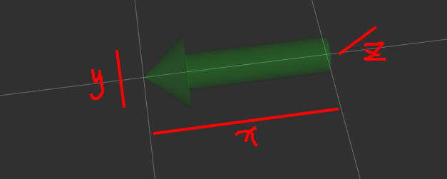

# Marker

## Marker参考资料：

[RViz学习笔记（二） - Markers: 发送基本的形状--简书](https://www.jianshu.com/p/62b7a8f8a614)

[ROS_rviz_DisplayTypes_Marker官网教程](http://wiki.ros.org/rviz/DisplayTypes/Marker)

## tips:

需要发布用到的frame_id（/odom, /my_frame）相对于世界坐标系map的关系,命令为：

```
rosrun tf static_transform_publisher 0.0 0.0 0.0 0.0 0.0 0.0 map odom 100
```


## Marker核心元素：

```
Marker.header.frame_id = "/my_frame";   //设置该Marker的坐标系

Marker.header.stamp  = ros::Time::now();  //设置时间戳

Marker.ns = "basic_shapes";  //使用相同命名空间和id发送的任何标记都将覆盖旧标记

Marker.id = 0;  //不知道有什么用

Marker.shape = visualization_msgs::Marker::CUBE/SPHERE/ARROW/CYLINDER;   //Marker的形状

Marker.action = visualization_msgs::Marker::ADD;   //设置marker的动作，选项是ADD,DELETE,在ROS indigo中还有DELETEALL

Marker.pose.position.x = 0;   //Marker的位置，相对于frame_id的坐标系
Marker.pose.position.y = 0;
Marker.pose.position.z = 0;

Marker.pose.orientation.x = 0;  //Marker的方向
Marker.pose.orientation.y = 0;
Marker.pose.orientation.z = 0;
Marker.pose.orientation.w = 1.0;

Marker.scale.x = 1.0;   设置Marker的比例——这里的 1x1x1 表示一边是 1m
Marker.scale.y = 0.5;
Marker.scale.z = 0.3;

Marker.color.r = 0.0f;  //设置Marker的颜色，每个数字介于0-1之间
Marker.color.g = 1.0f;
Marker.color.b = 0.0f;
Marker.color.a = 1.0;    //透明度，一定要设置成比0大的值

Marker.lifetime = ros::Duration(0.5);  //对象在被自动删除之前应该持续多长时间。 0 表示永远
```

```cpp
#include <ros/ros.h>
#include <visualization_msgs/Marker.h>    //Marker可以显示基本形状
/*
Marker核心元素：
Marker.header.frame_id = "/my_frame";   //设置该Marker的坐标系
Marker.header.stamp  = ros::Time::now();  //设置时间戳
Marker.ns = "basic_shapes";  //使用相同命名空间和id发送的任何标记都将覆盖旧标记
Marker.id = 0;  //不知道有什么用
Marker.shape = visualization_msgs::Marker::CUBE/SPHERE/ARROW/CYLINDER;   //Marker的形状
Marker.action = visualization_msgs::Marker::ADD;   //设置marker的动作，选项是ADD,DELETE,在ROS indigo中还有DELETEALL

Marker.pose.position.x = 0;   //Marker的位置，相对于frame_id的坐标系
Marker.pose.position.y = 0;
Marker.pose.position.z = 0;
Marker.pose.orientation.x = 0;  //Marker的方向
Marker.pose.orientation.y = 0;
Marker.pose.orientation.z = 0;
Marker.pose.orientation.w = 1.0;
Marker.scale.x = 1.0;   设置Marker的比例——这里的 1x1x1 表示一边是 1m
Marker.scale.y = 0.5;
Marker.scale.z = 0.3;

Marker.color.r = 0.0f;  //设置Marker的颜色
Marker.color.g = 1.0f;
Marker.color.b = 0.0f;
Marker.color.a = 1.0;    //透明度，一定要设置成比0大的值

Marker.lifetime = ros::Duration(0.5);  //对象在被自动删除之前应该持续多长时间。 0 表示永远
*/
int main( int argc, char** argv )
{
  ros::init(argc, argv, "basic_shapes");
  ros::NodeHandle n;
  ros::Rate r(1);
  ros::Publisher marker_pub = n.advertise<visualization_msgs::Marker>("visualization_marker", 1);

  // Set our initial shape type to be a cube
  uint32_t shape = visualization_msgs::Marker::ARROW;

  while (ros::ok())
  {
    visualization_msgs::Marker marker;
    // Set the frame ID and timestamp.  See the TF tutorials for information on these.
    marker.header.frame_id = "/my_frame";
    marker.header.stamp = ros::Time::now();

    // Set the namespace and id for this marker.  This serves to create a unique ID
    // Any marker sent with the same namespace and id will overwrite the old one
    marker.ns = "basic_shapes";
    marker.id = 0;

    // Set the marker type.  Initially this is CUBE, and cycles between that and SPHERE, ARROW, and CYLINDER
    marker.type = shape;

    // Set the marker action.  Options are ADD, DELETE, and new in ROS Indigo: 3 (DELETEALL)
    marker.action = visualization_msgs::Marker::ADD;

    // Set the pose of the marker.  This is a full 6DOF pose relative to the frame/time specified in the header
    //相对于
    marker.pose.position.x = 1;
    marker.pose.position.y = 0;
    marker.pose.position.z = 0;
    marker.pose.orientation.x = 0.0;
    marker.pose.orientation.y = 0.0;
    marker.pose.orientation.z = 0.0;
    marker.pose.orientation.w = 1.0;

    // Set the scale of the marker -- 1x1x1 here means 1m on a side
    marker.scale.x = 1;    //对于ARROW，是箭头的长度
    marker.scale.y = 0.2;   //对于ARROW，是箭头的宽度
    marker.scale.z = 0.2;   //对于ARROW，是箭头的高度

    // Set the color -- be sure to set alpha to something non-zero!
    marker.color.r = 0.0f;
    marker.color.g = 1.0f;
    marker.color.b = 0.0f;
    marker.color.a = 0.2;    //透明度

    // marker.lifetime = ros::Duration();
marker.lifetime = ros::Duration(0.5);

    // Publish the marker
    while (marker_pub.getNumSubscribers() < 1)
    {
      if (!ros::ok())
      {
        return 0;
      }
      ROS_WARN_ONCE("Please create a subscriber to the marker");
      sleep(1);
    }
    marker_pub.publish(marker);

    // Cycle between different shapes
    // switch (shape)
    // {
    // case visualization_msgs::Marker::CUBE:
    //   shape = visualization_msgs::Marker::SPHERE;
    //   break;
    // case visualization_msgs::Marker::SPHERE:
    //   shape = visualization_msgs::Marker::ARROW;
    //   break;
    // case visualization_msgs::Marker::ARROW:
    //   shape = visualization_msgs::Marker::CYLINDER;
    //   break;
    // case visualization_msgs::Marker::CYLINDER:
    //   shape = visualization_msgs::Marker::CUBE;
    //   break;
    // }

    r.sleep();
  }
}
```



x:长，y：宽，z：高。

# Path

## Path参考资料：

[（九）ROS在rviz中实时显示轨迹（nav_msgs/Path消息的使用）--csdn](https://blog.csdn.net/ktigerhero3/article/details/70256437)

```cpp
#include <ros/ros.h>
#include <ros/console.h>
#include <nav_msgs/Path.h>
#include <std_msgs/String.h>
#include <geometry_msgs/Quaternion.h>
#include <geometry_msgs/PoseStamped.h>
#include <tf/transform_broadcaster.h>
#include <tf/tf.h>

main(int argc, char **argv)
{
    ros::init(argc, argv, "showpath");

    ros::NodeHandle ph;
    ros::Publisher path_pub = ph.advertise<nav_msgs::Path>("trajectory", 1, true);

    ros::Time current_time, last_time;
    current_time = ros::Time::now();
    last_time = ros::Time::now();

    nav_msgs::Path path;
    path.header.stamp = current_time;
    path.header.frame_id = "odom";

    double x = 0.0;
    double y = 0.0;
    double th = 0.0;
    double vx = 0.1;
    double vy = -0.1;
    double vth = 0.1;

    ros::Rate loop_rate(1);
    while (ros::ok())
    {
        current_time = ros::Time::now();
        double dt = 0.1;
        double delta_x = (vx * cos(th) - vy * sin(th)) * dt;
        double delta_y = (vx * sin(th) + vy * cos(th)) * dt;
        double delta_th = vth *dt;

        x+=delta_x;
        y+=delta_y;
        th+=delta_th;

        geometry_msgs::PoseStamped this_pose_stamped;
        this_pose_stamped.pose.position.x = x;
        this_pose_stamped.pose.position.y = y;

        geometry_msgs::Quaternion goal_quat = tf::createQuaternionMsgFromYaw(th);
        this_pose_stamped.pose.orientation.x = goal_quat.x;
        this_pose_stamped.pose.orientation.y = goal_quat.y;
        this_pose_stamped.pose.orientation.z = goal_quat.z;
        this_pose_stamped.pose.orientation.w = goal_quat.w;

        this_pose_stamped.header.stamp = current_time;
        this_pose_stamped.header.frame_id= "odom";
        path.poses.push_back(this_pose_stamped);

        path_pub.publish(path);
        ros::spinOnce();
        last_time = current_time;
        loop_rate.sleep();
    }
    return 0;
}
```

